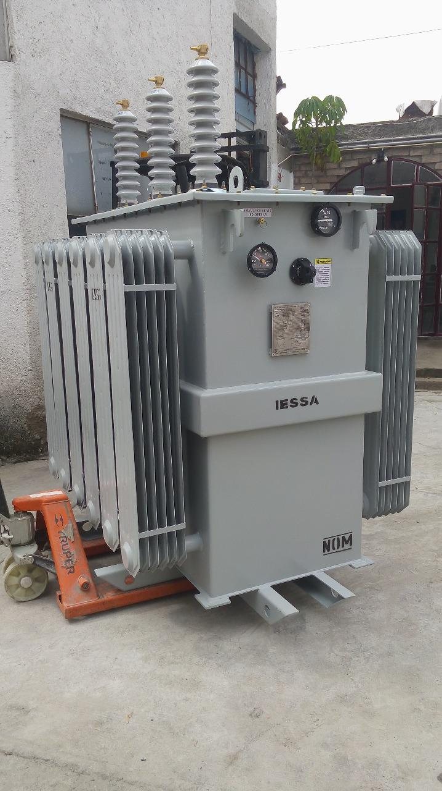

# Manual de instrucciones - Página Mebaten Premium

## Ubicación del proyecto

La versión premium de la página está en:

`C:\Users\Mebaten\Documents\Codex\2026-07-06\new-chat-2\outputs\mebaten-premium`

Archivos principales:

- `index.html`: contiene toda la página web, estilos CSS y comportamiento JavaScript.
- `assets/`: contiene el logo, fotografías principales y fotos de carruseles.
- `assets/carousel/`: contiene las fotos organizadas por categoría para la sección de proyectos reales.

## Qué se realizó

Se creó una página web de una sola página para Mebaten, basada en la información del sitio actual:

- `https://www.mebaten.com`
- `https://www.mebaten.com/productos`

El objetivo fue transformar el sitio en una experiencia más profesional, moderna e industrial, enfocada en clientes que buscan cotizar equipos eléctricos.

## Secciones incluidas

La página premium contiene estas secciones:

- Inicio
- Empresa
- Soluciones
- Productos
- Proyectos
- Calidad
- Contacto

La barra superior permanece fija y marca la sección activa mientras el usuario navega.

## Cambios visuales principales

Se aplicó una dirección visual más premium:

- Paleta basada en azul Mebaten, azul profundo, grises industriales y blanco.
- Uso del logo oficial de Mebaten.
- Fotografías reales de proyectos.
- Hero más limpio y equilibrado.
- Cards tipo bento para presentar fortalezas de la empresa.
- Tabs interactivos para productos.
- Galería de proyectos con carruseles por categoría.
- Animaciones suaves al hacer scroll.
- Barra de progreso superior.
- Botón flotante de WhatsApp.

## Logo

El logo oficial se guardó en:

`assets/mebaten-logo-full.png`

Se usa en:

- Barra superior fija.
- Footer.

## Imágenes y fotografías

Se extrajeron fotos reales desde el archivo RAR proporcionado por el usuario.

Las fotos principales están en:

`assets/`

Las fotos del carrusel están organizadas en:

- `assets/carousel/logistica/`
- `assets/carousel/transformadores/`
- `assets/carousel/subestaciones/`
- `assets/carousel/pedestal/`
- `assets/carousel/instalacion/`
- `assets/carousel/capacitores/`

Se cuidó que cada categoría tenga fotos correspondientes a su tema. Por ejemplo, transformadores solo muestra transformadores, logística muestra equipos en transporte, y capacitores muestra bancos de capacitores.

## Carruseles de proyectos reales

En la sección “Proyectos reales”, cada tarjeta tiene un carrusel automático.

Funcionamiento:

- Al pasar el cursor sobre una tarjeta, el carrusel empieza a cambiar fotos automáticamente.
- Al quitar el cursor, el carrusel se detiene.
- La tarjeta vuelve a su primera imagen.

Se eliminaron fotos duplicadas por hash para evitar repeticiones extrañas.

## Productos interactivos

La sección de productos usa pestañas para mostrar:

- Transformadores eléctricos
- Tableros eléctricos
- Bancos de capacitores
- Subestaciones compactas

Cada pestaña cambia:

- Imagen
- Descripción
- Beneficios
- Botón de cotización

## Formulario de cotización

El formulario incluye:

- Nombre
- Empresa
- Teléfono
- Correo
- Equipo requerido
- Capacidad requerida
- Ciudad / Estado
- Urgencia
- Mensaje

En esta versión estática, al enviar el formulario se abre un correo prellenado dirigido a:

`ventas@mebaten.com`

## WhatsApp

Se agregó un botón flotante de WhatsApp en la parte inferior derecha.

Actualmente apunta a:

`228-177-3814`

El enlace está configurado con:

`https://wa.me/522281773814`

## Cómo abrir la página

Puedes abrir directamente este archivo en el navegador:

`C:\Users\Mebaten\Documents\Codex\2026-07-06\new-chat-2\outputs\mebaten-premium\index.html`

También puedes copiar toda la carpeta `mebaten-premium` a otro lugar, siempre que mantengas el archivo `index.html` junto con la carpeta `assets`.

## Cómo editar textos

Abre `index.html` con un editor de texto o código.

Los textos principales están dentro del HTML, entre etiquetas como:

- `<h1>`
- `<h2>`
- `<h3>`
- `<p>`
- `<figcaption>`

Ejemplo:

```html
<h1>Soluciones eléctricas a la medida para tu proyecto</h1>
```

## Cómo cambiar imágenes

Para cambiar una imagen principal, busca una etiqueta como:

```html

```

Cambia el valor de `src` por la nueva imagen.

Para que funcione correctamente, guarda la nueva imagen dentro de `assets` o dentro de alguna subcarpeta de `assets`.

## Cómo cambiar fotos de un carrusel

Cada carrusel está definido con el atributo `data-carousel`.

Ejemplo:

```html
data-carousel="assets/carousel/logistica/logistica-01.jpeg|assets/carousel/logistica/logistica-02.jpeg"
```

Cada imagen se separa con el símbolo:

`|`

Para agregar una foto:

1. Copia la imagen a la carpeta correspondiente.
2. Agrega su ruta al atributo `data-carousel`.
3. Sepárala de las demás usando `|`.

## Cómo cambiar colores

Los colores principales están al inicio del CSS dentro de `:root`.

Ejemplo:

```css
:root {
  --navy: #082b55;
  --blue: #0a4f90;
  --blue-soft: #e8f3fb;
}
```

Si quieres cambiar el azul principal, edita:

`--blue`

## Validaciones realizadas

Durante el desarrollo se validó:

- Que el logo no se cortara en la barra superior.
- Que no hubiera desborde horizontal.
- Que los tabs de productos funcionaran.
- Que los carruseles tuvieran rutas existentes.
- Que los carruseles no usaran imágenes duplicadas por hash.
- Que los textos no tuvieran errores de codificación como `Ã` o `Â`.
- Que se corrigiera “años” con ñ.

## Versiones existentes

Versión premium actual:

`outputs\mebaten-premium\index.html`

Versión anterior:

`outputs\mebaten-onepage\index.html`

La recomendación es seguir trabajando sobre la versión premium.

## Mejoras CRO y confianza agregadas

Se agregaron estas mejoras al archivo principal:

- Se eliminó la sección "Clientes y proyectos" para mantener la página más enfocada.
- Franja de normas/certificaciones con placeholders en `assets/certifications/`.
- FAQ antes del formulario de contacto.
- Conteo animado para métricas del hero.
- Validación visual del formulario con mensajes debajo de campos obligatorios.
- Envío preparado para Formspree/Web3Forms/Getform usando `data-static-endpoint`.
- Respaldo por correo `mailto:` si no se configura un servicio externo.
- Meta etiquetas Open Graph, favicon, Apple touch icon y Schema.org Organization.
- Dimensiones `width` y `height` en imágenes para reducir saltos visuales.

## Cómo activar Formspree o un servicio similar

En `index.html`, busca:

```html
data-static-endpoint=""
```

Coloca ahi la URL real del servicio de formularios, por ejemplo la URL de Formspree, Web3Forms o Getform.

Mientras no se cambie ese valor, el sitio usará el correo prellenado como respaldo.

## Pendientes para completar placeholders

- Normas exactas que aplican a cada producto.
- Especificaciones técnicas reales: kVA, kVAr, voltajes, montaje, amperaje y configuración.
- Imagen Open Graph real para compartir en WhatsApp/redes: `assets/mebaten-og.jpg`.
- Versión comprimida del logo grande para header y footer.

## Recursos externos agregados

Se agregaron estas lineas en el `<head>` de `index.html`:

```html
<link href="https://fonts.googleapis.com/css2?family=Barlow+Condensed:wght@600;700;800&family=Manrope:wght@400;500;600;700;800;900&display=swap" rel="stylesheet" />
<script src="https://unpkg.com/lucide@latest/dist/umd/lucide.min.js" defer></script>
```

La primera carga la tipografia de titulos y cuerpo. La segunda carga los iconos de linea Lucide.

## Mejoras visuales agregadas

- Paleta con acento industrial `--accent: #f1b434`.
- Botones primarios, numeros destacados y estados activos usan el color de acento.
- Iconos de linea reemplazan letras/numeros en tarjetas de Empresa y Soluciones.
- Hero con fondo animado sutil y parallax.
- Se elimino la seccion Ruta comercial y su fondo logistico se reubico en la seccion Soluciones.
- Tarjetas con borde superior de acento al pasar el cursor.
- Proyectos con overlay que cambia en hover.
- Tabs de producto con underline animado.
- Boton flotante de WhatsApp con pulso sutil.
- Reveal de elementos con leve escala.

## Recomendacion de optimizacion de imagenes

Logo del header:

1. Abrir `assets/mebaten-logo-full.png`.
2. Exportarlo a 300-400 px de ancho.
3. Guardarlo como PNG optimizado o WebP.
4. Objetivo de peso: menos de 30 KB.
5. Reemplazar el archivo actual o crear uno nuevo, por ejemplo `assets/mebaten-logo-header.webp`, y actualizar el `src` en el header/footer.

Fotos del carrusel:

1. Convertir las imagenes de `assets/carousel/` a WebP.
2. Usar calidad aproximada 70-82.
3. Mantener nombres claros por categoria: `transformadores-01.webp`, `logistica-01.webp`, etc.
4. Actualizar los `src` y `data-carousel` en `index.html`.
5. Mantener siempre `width`, `height` y `loading="lazy"` en las etiquetas de imagen.
